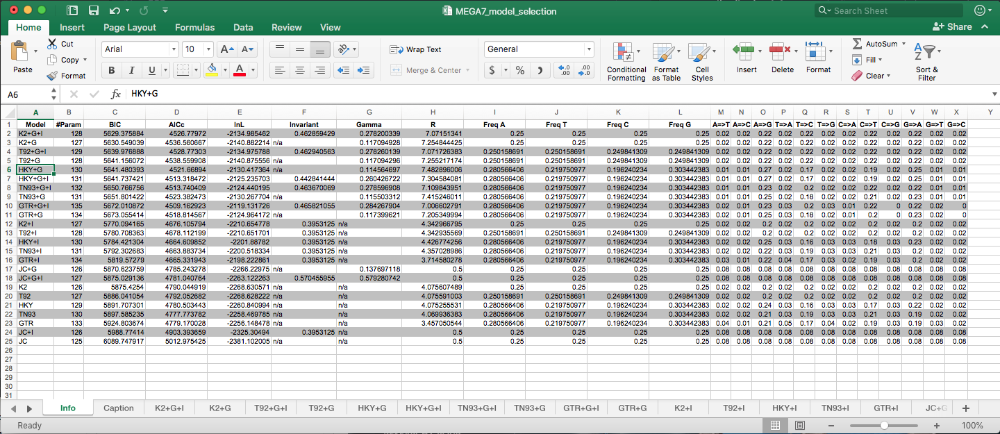

# Models

source: `{{ page.path }}`

Phylogenetics - overview of model types

An excellent summary of the different models (listed below) is directly sourced from Evolution and Geonomics Workshop ([link here](http://evomics.org/resources/substitution-models/nucleotide-substitution-models/)).

Highly recommend you check out the rest of the website for some great resources and detailed information & tutorials.

The use of maximum likelihood (ML) algorithms in developing phylogenetic hypotheses requires a model of evolution. The frequently used General Time Reversible (GTR) family of nested models encompasses 64 models with different combinations of parameters for DNA site substitution. The models are listed here from the least complex to the most parameter rich.

Some common programs to carry out phylogenetic analysis include:

* [MrBayes](http://nbisweden.github.io/MrBayes/)
* [PAUP*](https://paup.phylosolutions.com/)
* [BEAST v2](http://www.beast2.org)
* [PhyML v3](http://www.atgc-montpellier.fr/phyml/)
* [PAML](http://evomics.org/resources/software/molecular-evolution-software/paml/)
* [RAxML](https://sco.h-its.org/exelixis/software.html)
* [IQ-TREE](http://www.iqtree.org/)

The below also include the settings if the model is available in these programs. [Some good info here](http://phylobotanist.blogspot.com/2016/06/implementation-of-substitution-models.html).

**Jukes-Cantor (JC/JC69)** equal base frequencies, all substitutions equally likely (Jukes and Cantor 1969)

- [x] MrBayes `nst=1`
- [x] PAUP `aaaaaa`
- [x] PAML `aaaaaa`
- [x] BEAST
- [x] PhyML
- [x] IQ-TREE

**Felsenstein 1981 (F81)** variable base frequencies, all substitutions equally likely (Felsenstein 1981)

  - [x] MrBayes `nst=1`
  - [x] PAUP `aaaaaa`
  - [x] PAML `aaaaaa`
  - [x] BEAST (check)
  - [x] PhyML
  - [x] IQ-TREE

**Kimura 2-parameter (K80/K2)** equal base frequencies, one transition rate and one transversion rate (Kimura 1980)

- [x] MrBayes `nst=2`
- [x] PAUP `abaaba`
- [x] PAML `abbbba`
- [x] BEAST
- [x] PhyML
- [x] IQ-TREE

**Hasegawa-Kishino-Yano (HKY)** variable base frequencies, one transition rate and one transversion rate (Hasegawa et. al. 1985). Note this model is very similar to K80 however allows for variable base frequencies. It is also commonly the default model in many programs.

- [x] MrBayes `nst=2`
- [x] PAUP `abaaba`
- [x] PAML `abbbba`
- [x] BEAST
- [x] PhyML
- [x] IQ-TREE

**Tamura-Nei (TrN/TN93)** variable base frequencies, equal transversion rates, variable transition rates (Tamura Nei 1993)

- [ ] MrBayes
- [x] PAUP `abaaea`
- [x] PAML `abbbbf`
- [x] BEAST
- [x] PhyML
- [x] IQ-TREE

**Kimura 3-parameter (K3P)** variable base frequencies, equal transition rates, two transversion rates (Kimura 1981)

- [ ] MrBayes
- [x] PAUP (`abccba`)
- [x] PAML (`abccba`)
- [ ] BEAST
- [ ] PhyML
- [x] IQ-TREE

**Transition model (TIM)** variable base frequencies, variable transition rates, two transversion rates

- [ ] MrBayes
- [x] PAUP `abccea`
- [x] PAML `abccbe`
- [x] BEAST
- [ ] RAxML (check)
- [ ] PhyML
- [x] IQ-TREE

**Transversion model (TVM)** variable base frequencies, variable transversion rates, transition rates equal

- [ ] MrBayes
- [x] PAUP (`abcdbe`)
- [x] PAML (`abcdea`)
- [x] BEAST
- [ ] PhyML
- [x] IQ-TREE

**Symmetrical model (SYM)** equal base frequencies, symmetrical substitution matrix (A to T = T to A) (Zharkikh 1994)

- [x] MrBayes `nst=6`
- [x] PAUP `abcdef`
- [x] PAML `abcdef`
- [x] BEAST
- [ ] PhyML
- [x] IQ-TREE

**general time reversible (GTR)** variable base frequencies, symmetrical substitution matrix (e.g., Lanave et al. 1984, Tavare 1986, Rodriguez et. al. 1990)

- [x] MrBayes `nst=6`
- [x] PAUP `abcdef`
- [x] PAML `abcdef`
- [x] BEAST
- [x] PhyML
- [x] IQ-TREE

### Rate variation
In addition to models describing the rates of change from one nucleotide to another, there are models to describe rate variation among sites in a sequence. The following are the two most commonly used models and are generally available across all platforms and programs.

**gamma distribution (G)** gamma distributed rate variation among sites

**proportion of invariable sites (I)*** extent of static, unchanging sites in a dataset

***

# Programs

Some well resourced programs to carry out model selection include:

- [MEGA](https://www.megasoftware.net/)
- [PhyML](http://www.atgc-montpellier.fr/phyml/)
- [jmodeltest](https://github.com/ddarriba/jmodeltest2)
- [ModelFinder](https://doi.org/10.1038/nmeth.4285) which is implemented in [IQ-TREE](http://www.iqtree.org/)

Depending on the program most will produce two sets of 'scores' to assess the models.
the Akaike information criterion (AIC) and Bayesian information criterion (BIC).
The lower the score the more support there is for a particular model. There are different reasons for choosing the best model based on the AIC or BIC scores. Generally the BIC score is used in most cases, however if in doubt its always best to do some more research to understand why you chose that value. Some references for more information on these criterion available here [Luo A. *et al.* 2010](https://www.ncbi.nlm.nih.gov/pmc/articles/PMC2925852/); [Sullivan J. and Joyce P. 2005](https://www.annualreviews.org/doi/pdf/10.1146/annurev.ecolsys.36.102003.152633),[Brewer M. J. *et al.* 2016](https://besjournals.onlinelibrary.wiley.com/doi/full/10.1111/2041-210X.12541).

Example output from MEGA7 using Model Selection feature

