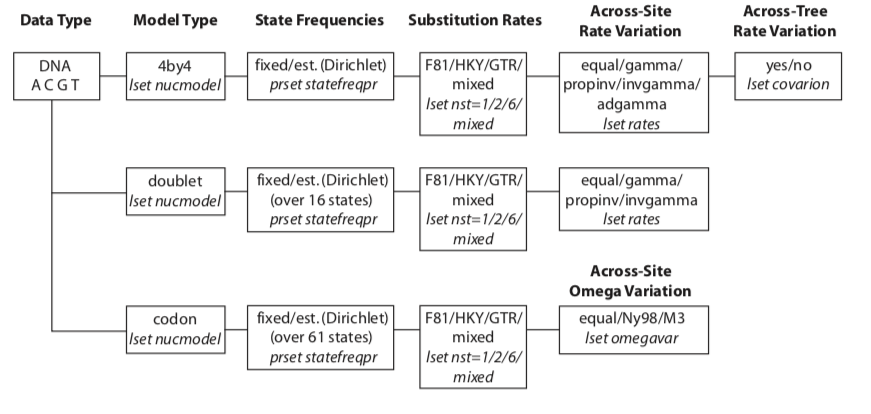
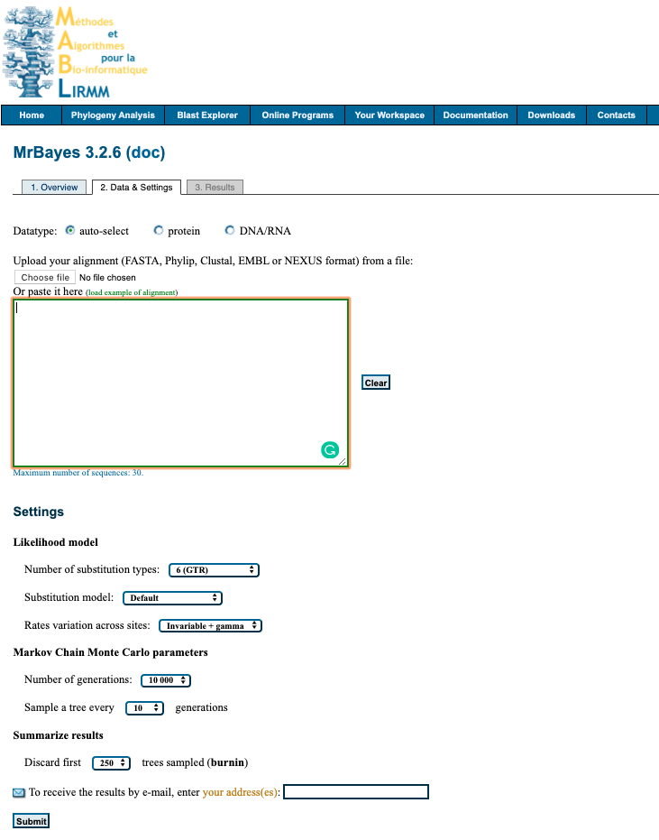
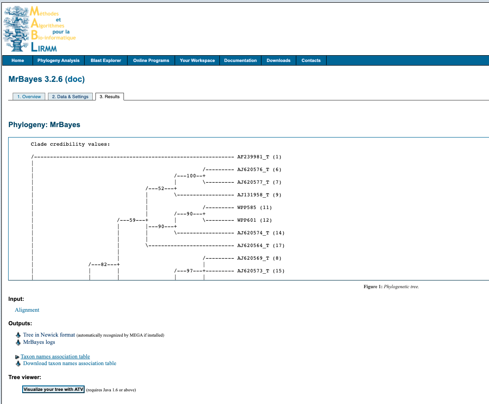

# MrBayes


source: `{{ page.path }}`

> Bayesian inference

<span class="badge badge-info">Phylogenetic analysis using Bayesian method</span>


MrBayes is a program for Bayesian inference and model choice across a wide range of phylogenetic and evolutionary models. MrBayes uses Markov chain Monte Carlo (MCMC) methods to estimate the posterior distribution of model parameters. Here I have described two options of using MrBayes (i) command line and (ii) webserver.


:link: **Useful resources and links**

- [Homepage](http://nbisweden.github.io/MrBayes/)
- [Manual v3.2](http://mrbayes.sourceforge.net/mb3.2_manual.pdf)
- [Tutorial](http://mrbayes.sourceforge.net/wiki/index.php?title=Tutorial&oldid=5239)
- [John P. Huelsenbeck and Fredrik Ronquist, Bayesian Analysis of Molecular Evolution Using MrBayes](http://citeseerx.ist.psu.edu/viewdoc/download;jsessionid=3C92ACF672625E025B8EAE2291777B2F?doi=10.1.1.134.3825&rep=rep1&type=pdf)


## Command line

Instructions for commandline workflow on MacOS for MrBayes v3.2

**Install**

Instructions on how to installl MrBayes are available [here](https://nbisweden.github.io/MrBayes/download.html) and [here](http://mrbayes.sourceforge.net/wiki/index.php/Introduction_3.2).

Download source code for compliation on Unix machines [3.2.7a](https://github.com/NBISweden/MrBayes/archive/v3.2.7a.tar.gz).

Open a terminal window and execute the following, remember you may need to navigate to change directory or move download file to currently working directory.
```bash
~ $ tar zxf mrbayes-3.2.tar.gz
~ $ cd mrbayes-3.2
~/mrbayes-3.2 $ ./configure
~/mrbayes-3.2 $ make
~/mrbayes-3.2 $ export CC=MyCompiler
~/mrbayes-3.2 % ./configure
```

You should now be ready to start!


### 1. Nexus file format

You will need to convert your aligned sequence file to a nexus file first.
Although this can commonly be done in most sequence analysis programs (e.g. geneious) using the `export as...` make sure you check the file formatting by opening the `nexus` file in a text editor program (e.g. atom).

I find a more reliable way is to use a web program to convert the fasta file to a nexus file - such as one available [here](http://sequenceconversion.bugaco.com/converter/biology/sequences/fasta_to_nexus.php).
Make sure the sequence names do not contain any of the following; hyphens `-`, commas`,`, semicolcons `:`, exclamation marks `!`.
Underscores `_` and periods `.` are okay.

### 2. Activate MrBayes

Type `mb` to activate MrBayes.

Set the data file for analysis

*Example* - alignment file called `AlignedSeqs.nexus`

```
execute AlignedSeqs.nexus
```

This will check will ensure your data is formatting and read correctly by the program. Any issues at this point are most likely due to the syntax and formatting of your nexus file.
Note: you may need to also include the path to the file if you are not already in the correct directory.
Generic Shell commands (e.g. `ls` `cd`) do not work in the MrBayes environment.

### 3. Specify the evolutionary model

This is where you start to set the parameters for your analysis. You will likely need to do some background work to figure out which is the correct model for your data - [see here](/Users/siobhonegan/Documents/Uni/PhD/code/notes-cheatsheets/Evolutionary_model_selection.md)

If your data are not DNA or RNA, if you want to invoke a different model, or if you want to use
non-default priors, refer to the MrBayes manual and Appendix for more help.




**Specifying a model**

Type `help lset` for more information


| Parameter | Options                                          | Current setting |
| --------- |:------------------------------------------------:| ---------------:|
| Nucmodel  | 4by4/Doublet/Codon/Protein                       | 4by4            |
| Nst       | 1(JC/F81)/2(HKY)/6(GTR)/Mixed                    | 1               |
| Code      | Universal/Vertmt/Mycoplasma/Yeast/Ciliates/Metmt | Universal       |
| Ploidy    | Haploid/Dilpoid/Zlinked                          | Diploid         |
| Rates     | Equal/Gamma/Propinv/Invgamma/Adgamma             | Equal           |
| Ngammacat | number                                           | 4               |
| Nbetacat  | number                                           | 5               |
| Omegavar  | Equal/Ny93/M3                                    | Equal           |
| Covarion  | No/Yes                                           | No              |
| Coding    | All/Variable/Noabsencesites/Nopresencesites      | All             |
| Parsmodel | No/Yes                                           | No              |


*Example* - Set to a GTR + I + G
To set a  General Time Reversible (GTR) model with Gamma (+G) invariable (+I) distribution, execute the following:
```
lset nst=6 rates=invgamma
```


### 4. Setting the Priors

**Priors**
Type `help prset` for more information

| Parameter       | Options                         | Current setting |
| --------------- |:-------------------------------:| ---------------:|
| Tratiopr        | Beta/Fixed                      | Beta(1.0,1.0) |
| Revmatpr        | Dirichlet/Fixed                 | Dirichlet(1.0,1.0,1.0,1.0,1.0,1.0) |
| Aamodelpr       | Fixed/Mixed                     | Fixed(Poisson) |
| Aarevmatpr      | Dirichlet/Fixed                 | Dirichlet(1.0,1.0,...) |
| Omegapr         | Dirichlet/Fixed                 | Dirichlet(1.0,1.0) |
| Ny98omega1pr    | Beta/Fixed                      | Beta(1.0,1.0) |
| Ny98omega3pr    | Uniform/Exponential/Fixed       | Exponential(1.0) |
| M3omegapr       | Exponential/Fixed               | Exponential |
| Codoncatfreqs   | Dirichlet/Fixed                 | Dirichlet(1.0,1.0,1.0) |
| Statefreqpr     | Dirichlet/Fixed                 | Dirichlet(1.0,1.0,1.0,1.0) |
| Shapepr         | Uniform/Exponential/Fixed       | Uniform(0.0,200.0) |
| Ratecorrpr      | Uniform/Fixed                   | Uniform(-1.0,1.0) |
| Pinvarpr        | Uniform/Fixed                   | Uniform(0.0,1.0) |
| Covswitchpr     | Uniform/Exponential/Fixed       | Uniform(0.0,100.0) |
| Symdirihyperpr  | Uniform/Exponential/Fixed       | Fixed(Infinity) |
| Topologypr      | Uniform/Constraints             | Uniform |
| Brlenspr        | Unconstrained/Clock             | Unconstrained:Exp(10.0) |
| Treeheightpr    | Exponential/Gamma               | Exponential(1.0) |
| Speciationpr    | Uniform/Exponential/Fixed       | Uniform(0.0,10.0) |
| Extinctionpr    | Uniform/Exponential/Fixed       | Uniform(0.0,10.0) |
| Sampleprob      | number                          | 1.00 |
| Thetapr         | Uniform/Exponential/Fixed       | Uniform(0.0,10.0) |
| Nodeagepr       | Unconstrained/Calibrated        | Unconstrained |
| Treeagepr       | Fixed/Uniform/Offsetexponential | Fixed(1.00) |
| Clockratepr     | Strict/Cpp/Bm                   | Strict |
| Cppratepr       | Fixed/Exponential               | Exponential(0.10) |
| Psigammapr      | Fixed/Exponential/Uniform       | Fixed(1.00) |
| Nupr            | Fixed/Exponential/Uniform       | Fixed(1.00) |
| Ratepr          | Fixed/Variable=Dirichlet        | Fixed |

*Example* - Set the G and I parameters
To manually set the shape parameter of the gamma distribution of rate variation (`Shapepr`) and the proportion of invariable sites (`Pinvarpr`), execute the following:

```
prset shapepr=fixed(0.05) pinvarpr=fixed(0.30)
```


### 5. Running Analysis

The analysis is started by issuing the mcmc command. However, before doing this, we recommend that you review the run settings by typing help mcmc. The help mcmc command will produce the following table at the bottom of the output:

| Parameter       | Options                         | Current setting |
| --------------- |:-------------------------------:| ---------------:|
| Ngen            | number                          | 1000000 |
| Nruns           | number                          | 2 |
| Nchains         | number                          | 4 |
| Temp            | number                          | 0.100000 |
| Reweight        | number,number                   | 0.00 v 0.00 ^ |
| Swapfreq        | number                          | 1 |
| Nswaps          | number                          | 1 |
| Samplefreq      | number                          | 500 |
| Printfreq       | number                          | 500 |
| Printall        | Yes/No                          | Yes |
| Printmax        | number                          | 8 |
| Mcmcdiagn       | Yes/No                          | Yes |
| Diagnfreq       | number                          | 5000 |
| Diagnstat       | Avgstddev/Maxstddev             | Avgstddev |
| Minpartfreq     | number                          | 0.10 |
| Allchains       | Yes/No                          | No |
| Allcomps        | Yes/No                          | No |
| Relburnin       | Yes/No                          | Yes |
| Burnin          | number                          | 0 |
| Burninfrac      | number                          | 0.25 |
| Stoprule        | Yes/No                          | No |
| Stopval         | number                          | 0.05 |
| Savetrees       | Yes/No                          | No |
| Checkpoint      | Yes/No                          | Yes |
| Checkfreq       | number                          | 100000 |
| Filename        | name                            | primates.nex |
| Startparams     | Current/Reset                   | Current |
| Starttree       | Current/Random/Parsimony        | Current |
| Nperts          | number                          | 0 |
| Data            | Yes/No                          | Yes |
| Ordertaxa       | Yes/No                          | No |
| Append          | Yes/No                          | No |
| Autotune        | Yes/No                          | Yes |
| Tunefreq        | number                          | 100 |


*Example*

```
mcmc ngen=1100000 samplefreq=200 printfreq=200 diagnfreq=2000
```


If the standard deviation of split frequencies is below 0.01 the specific number of generations, stop the run by answering no when the program asks `Continue the analysis? (yes/no)`.
Otherwise, keep adding generations until the value falls below `0.01`. If you are interested mainly in the well-supported parts of the tree, a standard deviation below `0.05` may be adequate.

Type `sump` to summarize the parameter values using the same burn-in as the diagnostics in the mcmc command. The program will output a table with summaries of the samples of the substitution model parameters, including the mean, mode, and 95 % credibility interval (region of Highest Posterior Density, HPD) of each parameter. Make sure that the potential scale reduction factor (PSRF) is reasonably close to 1.0 for all parameters; if not, you need to run the
analysis longer.

Summarize the trees using the same burn-in as the mcmc command by typing `sumt`. The program will output a cladogram with the posterior probabilities for each split (file ending `.trprobs`) and a phylogram with mean branch lengths (file ending `.con.tre`). Both trees will also be printed to a file that can be read by FigTree and other tree-drawing programs, such as `TreeView` and `Mesquite`.

It does not have to be more complicated than this; however, as you get more proficient you will probably want to know more about what is happening behind the scenes. The rest of this section explains each of the steps in more detail and introduces you to all the implicit assumptions you are making and the machinery that MrBayes uses in order to perform your analysis.

### Altering the model

**GTR**

GTR
`lset nst=6`

GTR + G
`lset nst=6 rates=gamma`

GTR + I
`lset nst=6 rates=inv`

GTR + G + I
`lset nst=6 rates=gammainv`

**K2P**

Use the HKY model and set the stationary state frequencies to be equal, this will give you a K2P model

K2P
`lset nst=2`
`prset statefreqpr=fixed(equal)`

K2P + G
`lset nst=2 rates=gamma`
`prset statefreqpr=fixed(equal)`

K2P + I
`lset nst=2 rates=inv`
`prset statefreqpr=fixed(equal)`

K2P + G + I
`lset nst=2 rates=invgamma`
`prset statefreqpr=fixed(equal)`

**HKY**

HKY
`lset nst=2`

HKY + G
`lset nst=2 rates=gamma`

HKY + I
`lset nst=2 rates=inv`

HKY + G + I
`lset nst=2 rates=gammainv`


***

## Web server

You can also use MrBayes via a web server, There is a variety to choose, check their limitations with regards to compute power to ensure it is going to work for you.

We'll use the sever by [MABL, MrBayes 3.2.6](http://www.phylogeny.fr/one_task.cgi?task_type=mrbayes) for this example.
Some limitations of this web server are:

* Max number of sequences = 30
* Max number of generations for MCMC analysis = 100,000

The interface looks like this:



### 1. Upload data

Upload your alignment either by pasting into box provided or uploading file. File formats accepted `FASTA`, `Phylip`, `Clustal`, `EMBL` or `NEXUS`.

### 2. Setting

Select your desired settings. If you are unsure below is a suggestions of where to start for analysing nucleotide data.

Likelihood model

* Number of substitution types: `6 (GTR)`
* Substitution model: `4by4`
* Rates variation across sites: `invgamma`

Markov Chain Monte Carlo parameters

* Number of generations: `100 000`
* Sample a tree every `100` generations

Summarize results

* Discard first `500` trees sampled (burnin)

### 3. Submit

Enter your email to recieve a notification when analysis is complete and click `Submit`

### 4. Output

Click on the link in the email and it will take you to this screen



Download the tree by right clicking on `Tree in Newick format` under the heading **Outputs** and select `Save link as...` with the `.tree` file format. You can open the file in something like [FigTree](http://tree.bio.ed.ac.uk/software/figtree/), node/branch labels reflect the poster probabilities of the analysis.

The analysis information is available by downloading the `MrBayes logs` file under the **Outputs** heading.
