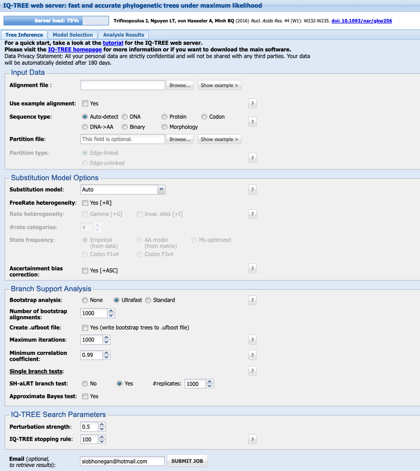
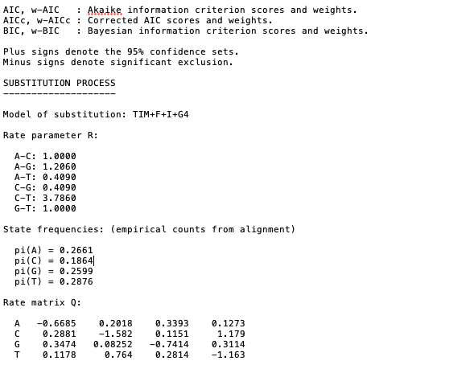

# ML - IQTREE

source: `{{ page.path }}`

Quick tutorial on using IQ-TREE webserver

[IQ-TREE](http://www.iqtree.org/) is available as a downloadable program and as an online interface (via web servers).

It is a powerful program that is built for speed! Maximum likelihood methods can consume a lot of compute power, the web interface can do robust analysis in just minutes.

It has some fantastic documentation with detailed tutorials - see [here](http://www.iqtree.org/doc/).
Current manual available [here](http://www.iqtree.org/doc/iqtree-doc.pdf).

Some key features of IQ-TREE are:

- **Efficient search algorithm:** Fast and effective stochastic algorithm to reconstruct phylogenetic trees by maximum likelihood.
- **Ultrafast bootstrap:** An ultrafast bootstrap approximation (UFBoot) to assess branch supports. UFBoot is 10 to 40 times faster than RAxML rapid bootstrap and obtains less biased support values.
- **Ultrafast model selection:** An ultrafast and automatic model selection (ModelFinder) which is 10 to 100 times faster than jModelTest and ProtTest. ModelFinder also finds best-fit partitioning scheme like PartitionFinder.
- **Phylogenetic testing:** Several fast branch tests like SH-aLRT and aBayes test (Anisimova et al., 2011) and tree topology tests like the approximately unbiased (AU) test (Shimodaira, 2002).

The strength of IQ-TREE is the availability of a wide variety of phylogenetic models:

- **Common models:** All common substitution models for DNA, protein, codon, binary and morphological data with rate heterogeneity among sites and ascertainment bias correction for e.g. SNP data.
- **Partition models:** Allowing individual models for different genomic loci (e.g. genes or codon positions), mixed data types, mixed rate heterogeneity types, linked or unlinked branch lengths between partitions.
- **Mixture Models:** fully customizable mixture models and empirical protein mixture models and.
- **Polymorphism-aware models (PoMo):** http://www.iqtree.org/doc/Polymorphism-Aware-Models

Personally I like to use the web interface, it saves one less program taking up memory on your computer and is super quick!

I like to use the [CIBID, Austria](http://iqtree.cibiv.univie.ac.at/).

Reference for command line options are available [here](http://www.iqtree.org/doc/Command-Reference)

## 1. Input Data

Your alignment file can be `.fasta.`, `.phylip`, `.nexus`.

Select the **`Sequence type`** (you can keep it as `Auto-detect` if you like, but this will save any issues incase it does not recognise your data correctly).

Leave the **`Partion file`** blank

## 2. Subtitution Model Options

Details on subtitution models available [here](http://www.iqtree.org/doc/Substitution-Models)

If you have not already chosen your model, under **`Substitution model`** leave it as `Auto` and it will perform model selection for you.

I generally leave the **`FreeRate heterogeneity`** and **`Ascertainment bias correction`** options unchecked.

## 3. Branch Support analysis

**`Bootstrap analysis`** select `Ultrafast`. This will perform bootstrap approximation using the UFBoot method [Minh et al. 2013](http://dx.doi.org/10.1093/molbev/mst024).

Check the box next to **`Create .ufboot file`** and select `10,000` for **`Maximum iterations`**. I leave **`Minimum correlation coefficient`** as `0.99` and **`SH-aLRT branch test`** as `Yes` with `1000` # replicates.
Select the check box next to **`Approximate Bayes test`**

## 4. IQ-TREE Search Parameters

I leave the **`Perturbation strength`** as `0.5` and **`IQ-TREE stopping rule`** as 100. `Approximate Bayes test` or `0.5`

Enter your email and **`SUBMIT JOB`**

## 5. Output

Either click on the **`Analysis`** tab long the top or follow the link in the email and you will find your results. I find this server is super quick, usually seconds/minutes for a basic gene alignment with <100 sequences.

Select the box on the left hand side of your analysis and click the **`DOWNLOAD SELECTED JOBS`** at the bottom.

You can now open the trees for editing in your fave program - mine is [FigTree](http://tree.bio.ed.ac.uk/software/figtree/).

Open the file ending in `.contree` to get the concensus tree. This will have the bootstrap supports (%) at the nodes.

If you open the `.treefile` you will find the support nodes for the SH-aLRT support (%) / aBayes support / ultrafast bootstrap support (%).

Details on the analysis including the results from the model selection, parameters, and citations can be found in the `.log` and `.iqtree` files [open these files using a simple text reader such as `TextEdit` for MacOS or similar].

Example of output from the `.iqtree` file showing that after model selection the phylogeny was based on the TIM + F + I + G4 subsitution model. Remember for more details on these model check out [details here](http://www.iqtree.org/doc/Substitution-Models)

