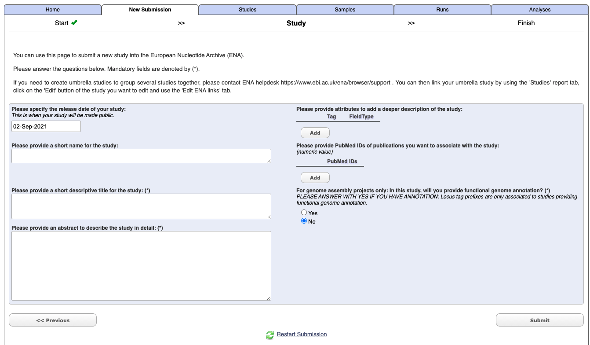
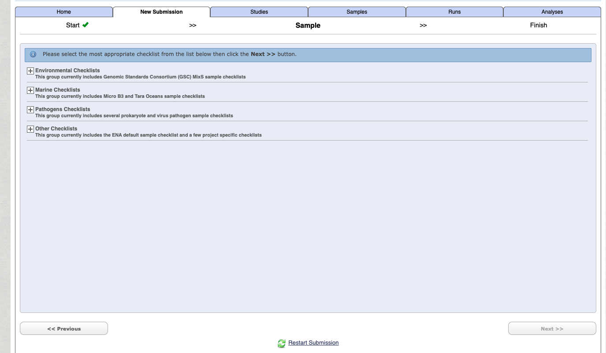
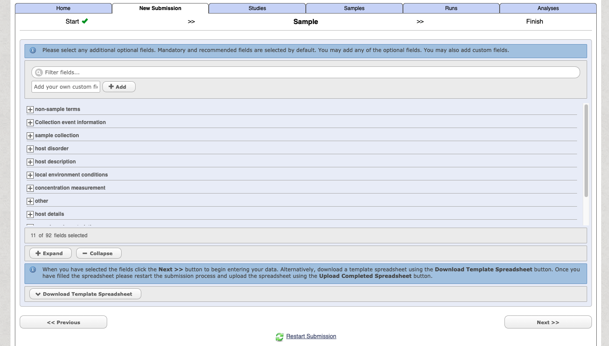

# Sequence repositories

source: `{{ page.path }}`



<span class="badge badge-info">Resources related to uploading sequences to repositories</span>


For publication many journals now have a mandatory requirement that you upload your data to public repositories.

For genomics the main repositories are the [National Centre for Biotechnology Information](https://submit.ncbi.nlm.nih.gov) and [European Nucleotide Archive](https://www.ebi.ac.uk/ena/browser/home).

:link: **Useful resources**

## Uploading high-throughput sequencing data to ENA

while I have uploaded high-throughput data to NCBI SRA in the past I have since found it not very user friendly.
As such I have switched to the ENA for submission of sequence data.

This documentation is works for me and is not extensive, it is meant to be a streamlined version of the information contained within the extensive information available at [ENA: Guidelines and Tutorials](https://ena-docs.readthedocs.io/en/latest/#).

For submitting data there are a number of options and this is written from a mac user.

See submission page [here](https://www.ebi.ac.uk/ena/browser/submit)

I use a combination of the following options:

- ['Submit to ENA Interactively'](https://www.ebi.ac.uk/ena/submit/sra/#home) - Submit to ENA with Webin Interactive
- ['Webin Submission Portal'](https://www.ebi.ac.uk/ena/submit/webin/) - Monitor progress of your submissions to eNA

### 1. Register project

Go to the Webin interface - i.e. select the 'Submit to ENA Interactively'(https://www.ebi.ac.uk/ena/submit/sra/#home) option from the [submission home page](https://www.ebi.ac.uk/ena/browser/submit).

Under the **New submission** tab select **Register study (Project)** [Register your Study to begin data submission to ENA], and press `next`

Enter your study details - not you do not need to include Tags or a PudMed Id at this stage.



Select submit.

Once it has completed you should get an email which will include a project/study accession number e.g. PRJXXXXXX.
It will also now appears under the **Studies** tab in the Webin interface.

### 2. Register samples

Under the **New submission** tab select **Register samples** [Register Samples to give context to your data], and press `next`

To begin with use the **Start building your submission** option to generate a sample sheet. Select the `Select Checklist` option open more details.



If you are unsure on which option is right for your generally for a lot of metabarcoding studies (e.g. bacteria 16S microbiome, 18S eukaryote etc) related to some "host" (either vertebrate or invertebrate) then choose the following:

> **GSC MIxS host associated** - Genomic Standards Consortium package extension for reporting of measurements and observations obtained from the environment where the sample was obtained. By choosing the environmental package, a selection of fields can be made from a relevant subsets of the GSC terms.

Select the checklist and press next.

You can then customise and add in additional fields



Select the download template option and then complete the spreadsheet.
The downloaded file with have a name like:
`data-2362730139549190230.tsv`.
When you open the file it will have a header similar to the following:
```
#checklist_accession
#unique_name_prefix
sample_alias
#template
#units
```

You start entering your sample information on line 6, and some notes on headers for the **GSC MIxS host associated** option:
- `sample_alias` - your sequence ID
- `tax_id` - You can find your taxonomy ID from the [NCBI taxonomy database](https://www-ncbi-nlm-nih-gov.libproxy.murdoch.edu.au/taxonomy)
- `scientific_name` - Your scientific name *must* be at the species level. Tips for working with environmental samples are [here](https://ena-docs.readthedocs.io/en/latest/faq/taxonomy.html#environmental-taxonomic-classifications)
- `common_name` - Free text
- `sample_title` - Free text
- `sample_description` - Free text
- `project name` - Free text, I use the project name I entered in the corresponding project registration
- `sequencing method` -
- `investigation type` - e.g. mimarks-survey
- `collection date` - acceptable formats include YYYY-MM-DD or YYYY
- `geographic location (country and/or sea)` - Must match the country names as they appear in the ENA data base. e.g. "Australia"
- `geographic location (latitude)` - DD format e.g. -33.69
- `geographic location (longitude)` - DD format e.g. 151.25
- `host-associated environmental package` - e.g. host-associated
- `environment (biome)` - [Australian biomes](https://www.environment.gov.au/land/nrs/science/ibra/australias-ecoregions)
- `environment (feature)` - e.g. animal-associated habitat
- `environment (material)` - free text e.g. Blood

You will then have to use to **Previous** button to navigate back to the stage where you can upload the sample sheet.

> file extension must be `.tsv` ot `.txt`

### 3. Upload sequence files

I have the easiest and quickest way to do this for large data is to to use the command line.

Details on [Uploading Files Using Command Line FTP Client
](https://ena-docs.readthedocs.io/en/latest/submit/fileprep/upload.html?highlight=lftp#uploading-files-using-command-line-ftp-client)

But put simply:

1. Open the terminal and navigate to the directory where the raw sequence files are.
2. Type `lftp webin2.ebi.ac.uk -u Webin-xxxxx`, filling in your Webin username and enter your Webin password when prompted. Type ls command to check the content of your directory (check your in the correct directory)
3. Use `mput <filename>` command to upload files. For bulk upload of zipped fastq files (i.e. ending in `.fastq.gz`) simply type `mput *.fastq.gz`
4. Once it has complete use `bye` command to exit the ftp client.

### 4. Run analysis

This will link your uploaded sequence files to their corresponding sample and project identifiers.

You must already have completed the following:

1. Register Project
2. Register Samples
3. Upload the raw sequence files

From the Webin submission page under the **New Submission** tab select **Submit sequence reads and experiments** [We recommend that Fastq, BAM, and CRAM read files are submitted using Webin-CLI]. Press next.

Select the project which you want to associate the run/experiment to. Note you can only select one project at a time.

It will then prompt you for sample information. However hopefully you have alreayd done this so select the **Skip** option in the bottom right hand corner.

Select your sequence file format e.g. CRAM, BAM, One Fastq file, Two Fastq files etc.

Then select the **Download Spreadsheet** option and complete the file with some tips below. The downloaded file with have a name like: `experiment_paired_fastq_spreadsheet.tsv`

Then **Upload Completed Spreadsheet** and once it has checked for errors, press the **Submit** button.

#### Notes for the experiment spreadsheet

**md5 generation**

To generate the md5 file you can use terminal and simple execute:

`md5 <file-name>`

For bulk execution you can use:

`md5 *.fastq.gz` which will generate something like this:

```
$ md5 example.fastq.gz
90fb727a1889a9e2194d838514beef19
```

**Spreadsheet headers**

Some tips here aimed at generation of paired-end sequence data:
- `project_accession` - this comes from when you first registered the project e.g. `PRJXXXXX`
- `project_alias` - you can leave this blank
- `experiment_alias` - a sequential ID for each sample e.g. for first sample ena-EXPERIMENT-INSTITUTION-DD-MM-YYYY-HH:MM:SS:XXX-1
- `run_alias`	- a sequential ID for each sample e.g. for first sample ena-RUN-INSTITUTION-DD-MM-YYYY-HH:MM:SS:XXX-1
- `library_name` - your identifier for library name
- `library_source` - e.g. GENOMIC
- `library_selection` - e.g. PCR
- `library_strategy` - e.g. AMPLICON
- `design_description` - brief description of library
- `library_construction_protocol` - brief description of library construction such as kit e.g. Nextera XT DNA
- `instrument_model` - e.g. Illumina MiSeq
- `file_type` e.g. fastq
- `library_layout` SINGLE *OR* PAIRED
- `insert_size` - numbers only in basepairs or nucleotide e.g. for 300 bp = 300
- `forward_file_name` - sample-id-R1.fastq.gz
- `forward_file_md5` - e.g. 90fb727a1889a9e2194d838514beef19
- `forward_file_unencrypted_md5` - can leave blank
- `reverse_file_name` - sample-id-R2.fastq.gz
- `reverse_file_md5` - e.g. 90fb727a1889a9e2194d838514beef19
- `reverse_file_unencrypted_md5` - can leave blank

> file extension must be `.tsv` ot `.csv`
